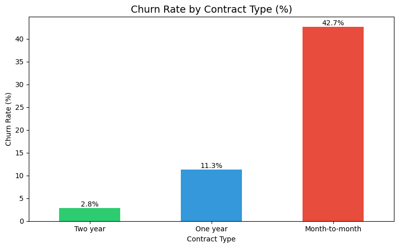
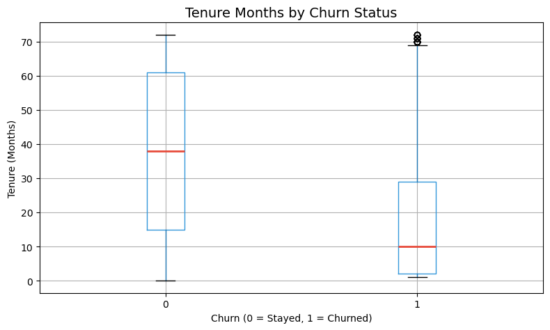
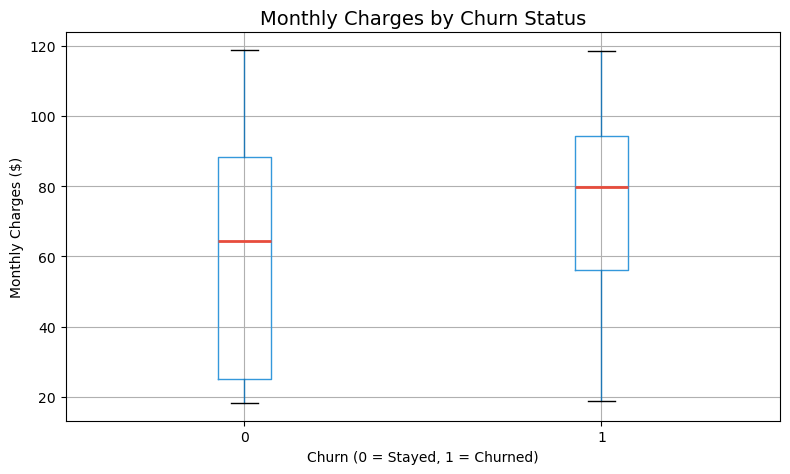
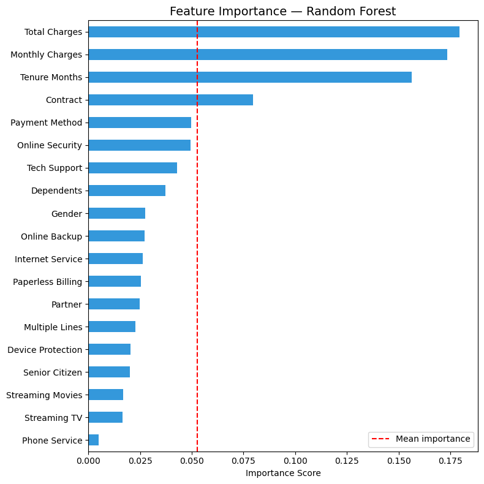

# Customer Churn Prediction

## Project Overview
This project analyzes customer churn behavior and predicts whether a customer is likely to leave the company.

## Dataset
- 7043 customers
- 33 features
- Target Variable: Churn Value

## Tools Used
- Python
- Pandas
- NumPy
- Matplotlib
- Seaborn
- Scikit-Learn

## Models Used
- Logistic Regression
- Random Forest

## Results
- Logistic Regression Accuracy: 80.34%
- Random Forest Accuracy: 79.49%

## Key Insights
- Month-to-month customers have higher churn rates.
- Customers with shorter tenure are more likely to churn.
- Higher monthly charges increase churn probability.

## Key Visualizations

### Customer Churn Distribution

### Churn Rate by Contract Type

### Tenure Months by Churn Status

### Monthly Charges by Churn Status

### Feature Importance - Random Forest

